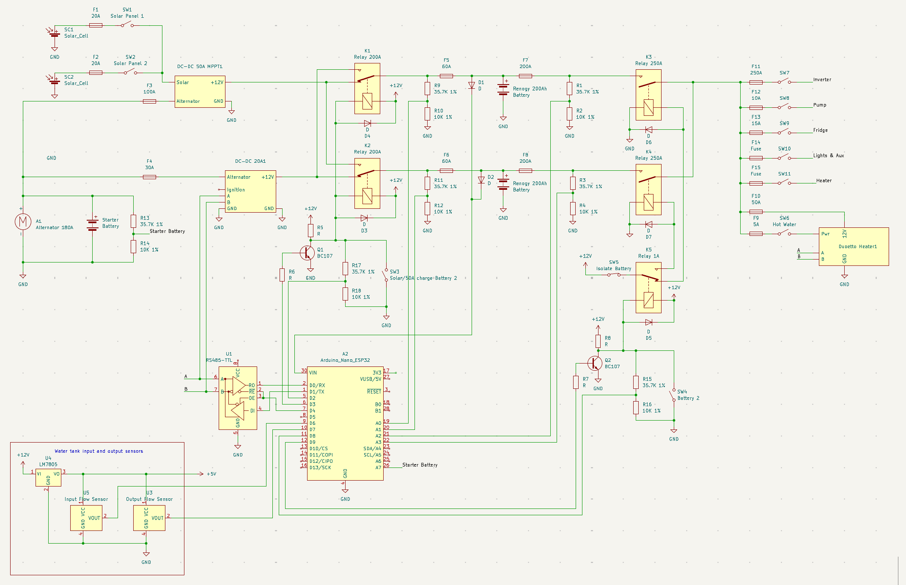
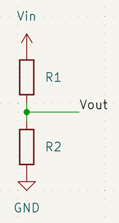
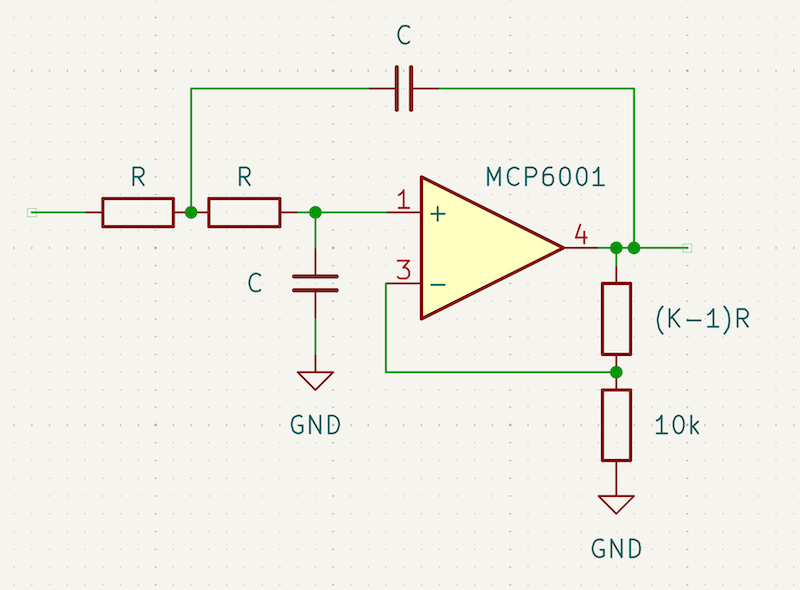

# CamperVan Design and Arduino Circuit Design

<!--toc:start-->
- [CamperVan Design and Arduino Circuit Design](#campervan-design-and-arduino-circuit-design)
  - [Campervan Design Overview](#campervan-design-overview)
  - [Dashboard App](#dashboard-app)
  - [Electrical System](#electrical-system)
    - [Sensors](#sensors)
  - [Circuit Design](#circuit-design)
    - [Battery and voltage monitoring](#battery-and-voltage-monitoring)
      - [Voltage Divider Design](#voltage-divider-design)
      - [Low Pass Filter](#low-pass-filter)
  - [TODO](#todo)
<!--toc:end-->

## Campervan Design Overview
I used [OpenScad](https://openscad.org/) to do the campervan design. Whilst I have used SketchUp in the past OpenScad appealed to me more as it is a programmers CAD program plus it is a parametric CAD program which allow me to quickly change a parameter to see how it affects the van layout e.g. visualising the Sofa Bed as a Sofa or a Bed, or easily changing the width of a cupboard, which would cause all other dependent cupboards to adjust accordingly.

## Dashboard App
The dashboard app on ios/macos to control the electrical system is written in Flutter and communicates to the Arduino control board via websockets. See [Campervan Flutter](https://github.com/akladnig/campervan_flutter) for details.

## Electrical System

The electrical system for the camper van needs to power the following devices:
- Induction Cooktop - 1800W
- Air Fryer - 1800W
- Duetto Hot Water - 300W
- Bushman 85l fridge -
- Water Pump -
- Lights & Fan - 

The power system needs to provide off-grid power for 3 days, which required a 4.8kW or 400Ah battery system.

Since 12V, 400A would require massive fuses, switches and cable etc. I've decided to run the system as 2x isolated batteries, rather than in parallel. This will reduce the need for 400A fuses and switches to 200A fuses ans switches.

The other issue is that the DC-DC battery charger has a maximum output of 50A which would result in a 7-8 hour charge time via the alternator. Being able to independently charge each battery with it's own battery charger solves this problem and also 2x 50A chargers are a lot cheaper than a single 100A charger.

The system is designed so the batteries can never be inadvertently connected in parallel.

There are two modes of operation:
- Manual
- Automatic

Manual mode will override any automatic setting and allows the selection of:
- which battery to use for powering appliances
- swapping the dc-dc battery chargers. This will allow selection of which battery to charge via Solar Cells/50A DC-DC charger or 20A DC-DC charger.

Automatic mode will select the battery to use for powering appliances. When the battery charge falls below a certain threshold it will swap to the other battery.

Automatic mode will also swap chargers during driving to ensure the optimum charge time for both batteries. When the ignition is off, charging via solar cells will automatically switch to the second battery when the first is fully charged.

### Sensors
There are a variety of sensors in use:
- voltage dividers
- RS485 which will require some reverse engineering
- Hall effect devices
- Bluetooth for the smart batteries and 50A DC-DC

The following devices are monitored for the associated properties using a voltage divider:
- Starter Battery voltage
- Battery 1 input voltage (before 60A fuse)
- Battery 1 output voltage (after 200A fuse)
- Battery 2 input voltage (before 60A fuse)
- Battery 2 output voltage (after 200A fuase)
- Battery 2 charge switch status - to a digital input
- Battery 2 switch status - to a digital input

The following are monitored via RS485:
- 20A DC-DC battery charger
- Duoetto Heater

The following are monitored via hall effect devices:
- Water input flow
- Water output flow

The following devices are bluetooth enabled:
- Battery 1
- Battery 2
- 50A DC-DC charger

Schematic design software used is [Kicad](https://www.kicad.org/)

## Circuit Design
### General Design requirements
- All inputs and outputs of the main management module to be optically isolated to prevent any issues with voltage spikes damaging the module and to also reduce any potential issues with ground loops and noise.

### Battery and voltage monitoring
#### Linear OptoCoupler Design
An IL300 linear opto-coupler is used to monitor the voltage of the following:
- Starter Battery
- Battery 1
- Battery 2

#### Voltage Divider Design
The typical battery voltage ranges from 10.0V - 14.4V and the maximum input voltage levels are ether 3.3V or 5V depending on the Arduino device used.
In order to keep power consumption low large value resistors in the 100k range will be used. But with such large values noise increases (Johnson noise) and the inputs to the ADC on the Arduino or external ADC (MCP3008 or MCP3208) require a low impedance source so a unity gain low pass filter will be required.

Equation for the voltage divider is:

R1 = R2(Vin - Vout)/Vout

Using an input voltage of 15.0V and choosing R2 = 100k
Gives:

- R1 = 357k 1% for a 3.3V output
- R1 = 200k 1% for a 5V output

#### Low Pass Filter
A simple 2 pole Butterworth low pass filter will be used.
A quick web search shows that a 0.1Hz - 1Hz filter should be used, which sounds reasonable to me. I'll use 1Hz to keep the capacitor value on the lower end.

Formula for a low pass filter is:
- RC = 1/(2\*pi\*Cn\*f)

Cn and K are constants that are used to set various low pass filter types. For a 2 pole Butterworth the values are:
- Cn = 1
- K = 1.586

Refer to "The Art of Electronics page 408".

For:
- f = 1Hz
- C = 1uF

Gives:
- R = 154k 1%
- Rga = (K-1)R = 5k9 1% 

## TODO
 - add an Oled touch panel
 - ignition switch input

